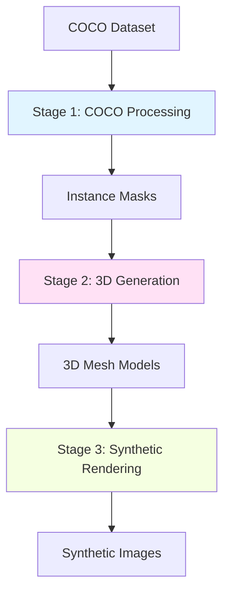

# Pipeline Overview

The COCO to 3D Synthetic Pipeline consists of three main stages, each designed to transform data from one representation to another.

## Architecture



## Stage 1: COCO Processing

**Input**: COCO-format annotation JSON file
**Output**: Instance segmentation masks

The COCO Processing stage handles:

- Loading and parsing COCO annotation files
- Extracting instance segmentation masks
- Organizing data by category
- Preprocessing and normalization

[Learn more about COCO Processing →](coco-processing.md)

## Stage 2: 3D Generation

**Input**: 2D instance segmentation masks
**Output**: 3D mesh models (OBJ, PLY formats)

The 3D Generation stage performs:

- Depth estimation from 2D masks
- 3D mesh reconstruction
- Texture mapping
- Model optimization and smoothing

[Learn more about 3D Generation →](3d-generation.md)

## Stage 3: Synthetic Rendering

**Input**: 3D mesh models
**Output**: Rendered synthetic images

The Synthetic Rendering stage creates:

- Multiple viewpoint renders
- Varied lighting conditions
- Different background scenes
- Augmented training data

[Learn more about Synthetic Rendering →](synthetic-rendering.md)

## Data Flow

1. **COCO Annotations** → Parse JSON structure
2. **Instance Masks** → Extract binary masks for each object
3. **3D Reconstruction** → Generate mesh from mask contours
4. **Texture Application** → Apply colors/textures to 3D model
5. **Scene Setup** → Position camera, lights, and background
6. **Rendering** → Generate final synthetic images

## Configuration

Each stage can be configured independently through YAML configuration files in the `configs/` directory:

```yaml
# configs/pipeline.yaml
coco_processing:
  min_area: 100
  categories: ["person", "car", "bicycle"]

3d_generation:
  depth_estimator: "midas"
  mesh_resolution: 256

synthetic_rendering:
  num_viewpoints: 8
  lighting: "studio"
  background: "random"
```

## Performance Considerations

- **GPU Acceleration**: 3D generation and rendering benefit significantly from GPU
- **Batch Processing**: Process multiple instances in parallel
- **Caching**: Cache intermediate results to avoid recomputation
- **Memory Management**: Large datasets may require streaming/chunking

## Next Steps

Dive deeper into each stage:

- [COCO Processing Details](coco-processing.md)
- [3D Generation Techniques](3d-generation.md)
- [Synthetic Rendering Options](synthetic-rendering.md)
